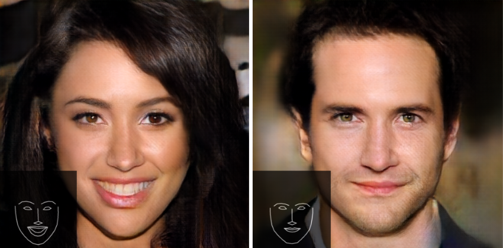
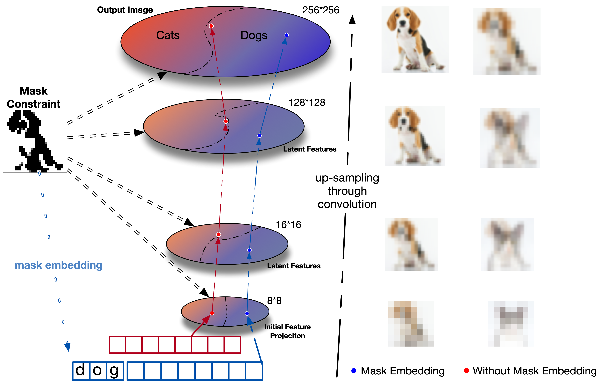
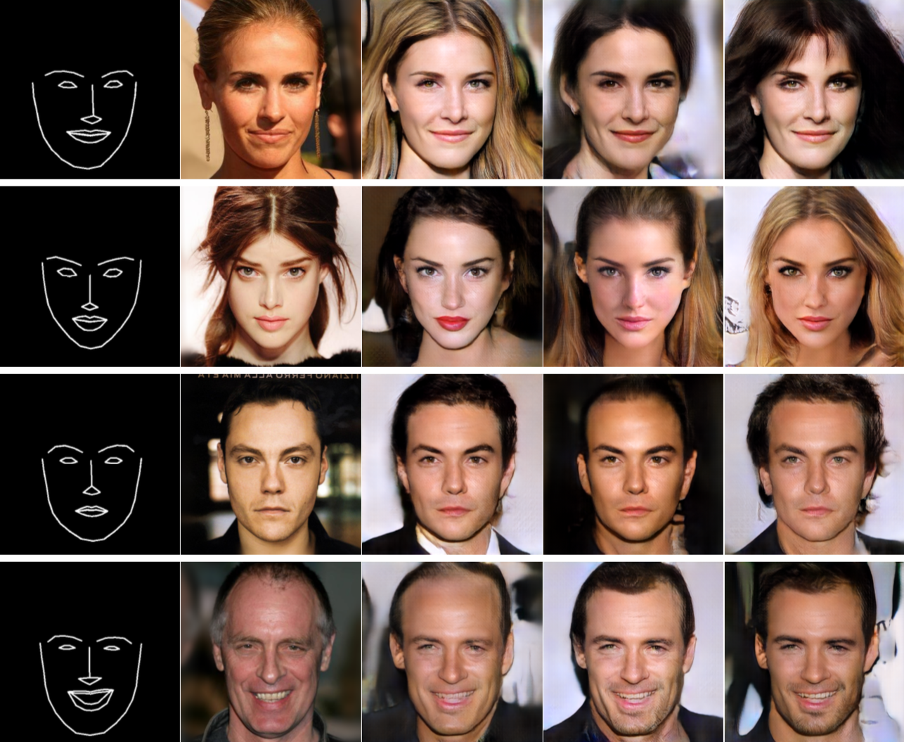

# Mask Embedding in conditional GAN for Guided Synthesis of High Resolution Images
## About

Yinhao Ren, Zhe Zhu, Yingzhou Li, Joseph Lo

This work is built upon our re-implementation of "Progressive Growing of GANs for Improved Quality, Stability, and Variation". We achived semantic control of celebrity face generation using the proposed mask embedding techqniue for better model parameter efficiency. [Here is the link to our early release paper (arXiv)](https://arxiv.org/abs/1907.01710).




## Abstract
Recent advancements in conditional Generative Adversarial Networks
(cGANs) have shown promises in label guided image synthesis. Semantic
masks, such as sketches and label maps, are another intuitive and
effective form of guidance in image synthesis. Directly incorporating
the semantic masks as constraints dramatically reduces the variability
and quality of the synthesized results. We observe this is caused by
the incompatibility of features  from different  inputs (such as mask
image and latent vector) of the generator. To use semantic masks as
guidance whilst providing realistic synthesized results with fine
details, we propose to use mask embedding mechanism  to allow for
a more efficient  initial feature projection  in the generator. We
validate the effectiveness of our approach by training a mask guided
face generator using  CELEBA-HQ dataset. We can generate realistic and
high resolution facial images up to the resolution of 512 by 512
with a mask guidance.




## Preparing the Dataset
We added binary face masks to the CELEBA-HQ dataset using landmarks detected by the Dilib face landmark detector (https://github.com/davisking/dlib). The files are stored in TfRecord format. [Here is the downloadable link](https://deckard.duhs.duke.edu/~yr41/celebaHQ_mask). Each file contains the same 27000 images but at different resolution for data steaming efficiecy.


## Training
Setup the dataset in appropriate format and than modified the `data_folder` in `config.py` to specify the path to training data. The current implementation uses TfRecord format but switching to png should requires minmum modification to the `parse_func` function. The input pipeline is build in the `Input_Pipeline_celeba.py` using tesnorflow's Dataset API. Network impementations are in `network_utility.py`. 

To train the model for `Phase n` call `train.py` with all required parameters:

`python3 -W ignore train.py --GPU NUM_GPUs --phase PHASE_NUM --smooth USE_SMOOTH --size SIZE --epoch TOTAL_EPOCH --batch_size BATCH_SIZE --lr LEARNING_RATE --n_critic NUM_CRITIC --use_embedding USE_EMBEDDING`

You can also use provided bash script `starts_jobs_embedding.sh` to execuate each phase of the progressive training schedule:

`./starts_jobs_embedding.sh`

## Sample output



## Cite us
```
@article{Ren2019MaskEI,
  title={Mask Embedding in conditional GAN for Guided Synthesis of High Resolution Images},
  author={Yinhao Ren and Zhe Zhu and Yingzhou Li and Joseph Lo},
  journal={ArXiv},
  year={2019},
  volume={abs/1907.01710}
}
```
